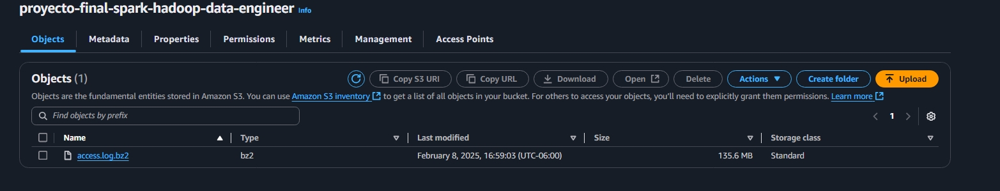
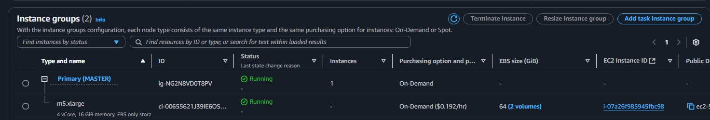
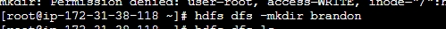
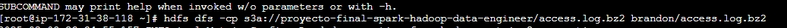
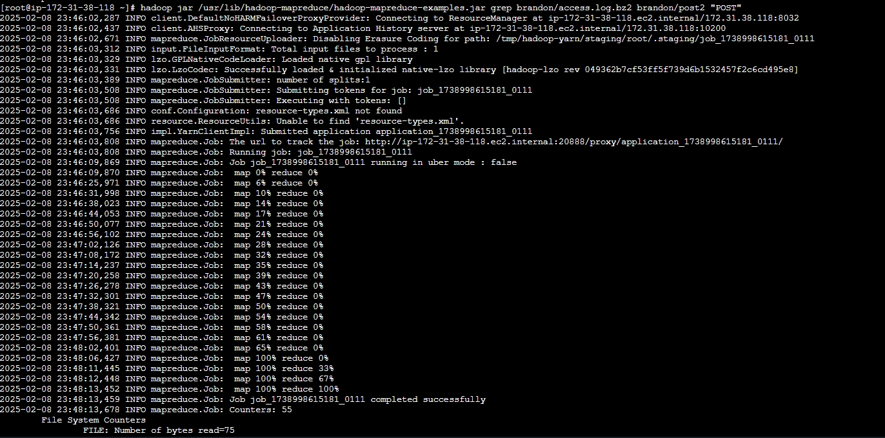
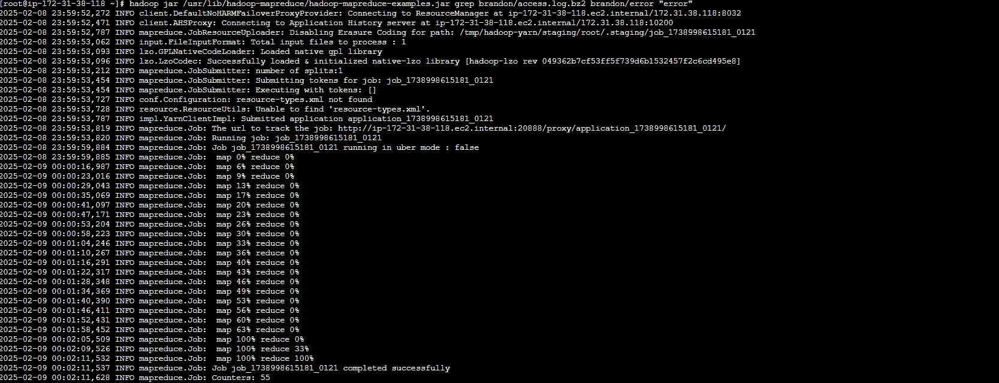
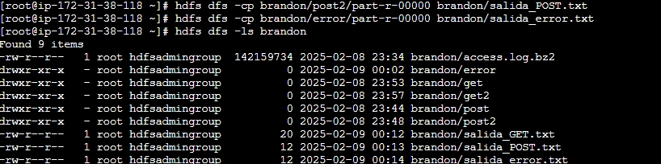
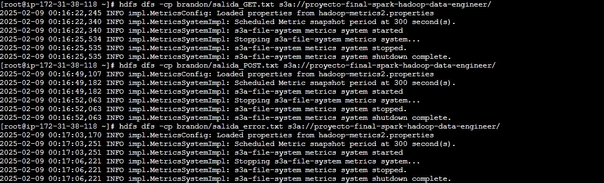
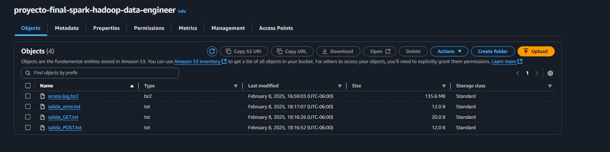

# Proceso ETL con Hadoop dentro de un cluster de Amazon EMR 
---
El objetivo de este proyecto es  realizar un porcesamiento de los datos por lotes  para poder encontrar coincidencias dentro  del archivo con cadenas de texto

GET /image/
POST
error

Decidi usar Hadoop dentro del cluster de EMR para que el porceamiento fuera eficaz ya que  se cuenta con tres instancia , una mestra y dos esclavas  a diferencia de la instancia de ubuntu que levantamos individualmente
el matro y los esclavos se encontraban dentro de contenedores 

---

## Extraccion  
para este proyecto se uso un DataSet con registros de logs de peticiones API  de la pagina  https://www.kaggle.com/datasets/eliasdabbas/web-server-access-logs

##### 1. Subir el archivo a un bucket de S3 en formato .bz2 , este formato de compresion es soportada por hadoop y respeta el formato del texto 


##### 2. Conectarse a la instancia maestra del cluster  



##### 3. Crea una carpeta dentro de el sistema de archivo de hadoop HDFS
 esto para colocar el objeto que se encuentra en el Bucket

```
hdfs dfs -mkdir brandon
```


##### 4. Copia el objeto hacia la capeta que se creo en el paso anterior
```
hdfs dfs -cp s3a://proyecto-final-spark-hadoop-data-engineer/access.log.bz2 brandon/access.log.bz2
```




puedes verificar que el contenido se encuentra con 
```
hdfs dfs -ls brandom
```

## Transformacion o procesamiento de los datos  

##### 5. Realizar el conteo de palabras mediantante MapReduce
diseñado para procesar grandes volúmenes de datos en paralelo y de manera distribuida en un clúster de computadoras
 realizamso el conteo de la cadena de caracteres "GET /image/

 ten en cuenta que este proceso es tardado debido a la gran cantidad de datos que se procesan por lo que el resultado puede tardar unos minutos
```
 hadoop jar /usr/lib/hadoop-mapreduce/hadoop-mapreduce-examples.jar grep brandon/access.log.bz2 brandon/get2 "GET /image/"
```


##### 6.Revisar el archivo de salida para ver el conteo

```
 hdfs dfs -cat brandon/get2/part-r-00000
```


 para este caso tenemos 5682613  veces GET  /image/
```
```
##### 8. Realizamos los mismo pasos para la cadena "POST"
```
hadoop jar /usr/lib/hadoop-mapreduce/hadoop-mapreduce-examples.jar grep brandon/access.log.bz2 brandon/post2 "POST"
```


```
 hdfs dfs -cat brandon/post2/part-r-00000
```


##### 9. Y finalmente para la cadena "error

```
hadoop jar /usr/lib/hadoop-mapreduce/hadoop-mapreduce-examples.jar grep brandon/access.log.bz2 brandon/error "error"
```


```
 hdfs dfs -cat brandon/post2/part-r-00000
```


##### 10. los archivos que se generaron en las diferentes carpetas los copiamos dentro de HDFS, pero los copiamos como .txt 

```
hdfs dfs -cp brandon/get2/part-r-00000 brandon/salida_GET.txt
```
```
hdfs dfs -cp brandon/post2/part-r-00000 brandon/salida_POST.txt
```
```
hdfs dfs -cp brandon/error/part-r-00000 brandon/salida_error.txt
```

y verifica que los archivos se hayan copiado 

```
hdfs dfs -ls brandon
```


## Carga
##### 11. Cargamos los archivo en un bucket s3

cargamos los archivo en un bucket s3 en este caso usaremos el mismo bucket donde se encuentra nuestro archivo origina .log.gz2 
lo mas recomendable es colocarlos en diferentes carperas como raw/ y processed/ 
```
hdfs dfs -cp brandon/salida_GET.txt s3a://proyecto-final-spark-hadoop-data-engineer/
```
```
hdfs dfs -cp brandon/salida_POST.txt s3a://proyecto-final-spark-hadoop-data-engineer/
```
```
hdfs dfs -cp brandon/salida_error.txt s3a://proyecto-final-spark-hadoop-data-engineer/
```


##### 12. Revisar nuestro Bucket s3  para verificar que los archivos existan



 una vez qui  podemos descargarlos 

 --- 
 Resultados y conclusiones 
 Aunque Hadoop trabaja en memoria el tiempo de procesameinto de el archivo fue de 3-3.5 min por  cada una de las busquedas lo cual no es mucho para un archivo de 3.5 GB 

Resultados :
GET /image/      5682613
POST              139155
error            27678

Gracias.
