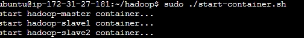

##Configuracion de  un entorno de Hadoop utilizando Docker,  realizar un proceso de ingesta de datos (subida de un archivo de texto a HDFS) y ejecución de un trabajo MapReduce para contar las palabras en el archivo
### ejercicio con el libro Alicia en el pais de las maravillas 
##### 1. pull docker image

```
sudo docker pull uracilo/hadoop
```

##### 2. Clonar repositorio github

```
git clone https://github.com/uracilo/hadoop.git
```

##### 3. Crear red para el cluster de hadoop

```
sudo docker network create --driver=bridge hadoop
```

##### 4. Inicializar el cluster

```
cd hadoop
sudo ./start-container.sh
```
**output:**




- Iniciar con 2  esclavos y un maestro
- Entraremos al contenedor master

##### 5. Iniciar hadoop

```
./start-hadoop.sh
```

##### 6. Un archivo txt de un libro

```
wget https://www.gutenberg.org/cache/epub/28885/pg28885.txt
```

##### 7. Crear un directorio

```
mkdir input
```

##### 8. Crear un archivo tipo tar.gz

```
tar -czvf input/odisea.tar.gz odisea.txt
```

-c: Generar archivo
-z: Comprimir con gzip.
-v: Progreso del proceso.
-f: Especificar nombre del archivo.


##### 9. Revisar los tamaños de nuestros archivos

```
ls -flarts input
```
##### 10. Crear y mover  directorio input al DFS de  HADOOP

```
hdfs dfs -mkdir -p test
hdfs dfs -put input
```

##### 11. Revisar nuestro input directorio en HADOOP

```
hdfs dfs –ls  input
```

##### 12. Leer las primeras lineas de nuestro archivo en HADOOP

```
hdfs dfs -cat  input/alicesAdventures.tar.gz | zcat | tail -n 20
```


##### 13. Eliminar el archivo en HADOOP

```
hdfs dfs –rm –f /user/rawdata/example/alicesAdventures.tar.gz
```

##### Plus ejecutar un trabajo en HADOOP

```
hadoop jar $HADOOP_HOME/share/hadoop/mapreduce/sources/hadoop-mapreduce-examples-2.7.2-sources.jar org.apache.hadoop.examples.WordCount input output
```

##### Plus ver el resultado del trabajo en HADOOP

```
hdfs dfs -cat output/part-r-00000
```


### Ejercicio con un libro diferente Meditacions de Marco Aurelio [iniciaremos desde el paso 6 ]


##### 6. Un archivo txt de un libro

```
wget https://www.gutenberg.org/cache/epub/2680/pg2680.txt
```


##### 7. Crear un directorio

```
mkdir input
```

##### 8. Crear un archivo tipo tar.gz

```
tar -czvf input/meditations.tar.gz odisea.txt
```

-c: Generar archivo
-z: Comprimir con gzip.
-v: Progreso del proceso.
-f: Especificar nombre del archivo.


##### 9. Revisar los tamaños de nuestros archivos

```
ls -flarts input
```

##### 10. Crear y mover  directorio input al DFS de  HADOOP

```
hdfs dfs -mkdir -p test
hdfs dfs -put input
```

##### 11. Revisar nuestro input directorio en HADOOP

```
hdfs dfs –ls  input
```


##### 12. Leer las primeras lineas de nuestro archivo en HADOOP

```
hdfs dfs -cat  input/meditations.tar.gz | zcat | tail -n 20
```


##### 13. Eliminar el archivo en HADOOP

```
hdfs dfs –rm –f /user/rawdata/example/meditations.tar.gz
```

##### Plus ejecutar un trabajo en HADOOP

```
hadoop jar $HADOOP_HOME/share/hadoop/mapreduce/sources/hadoop-mapreduce-examples-2.7.2-sources.jar org.apache.hadoop.examples.WordCount input output
```

##### Plus ver el resultado del trabajo en HADOOP

```
hdfs dfs -cat output/part-r-00000
```

